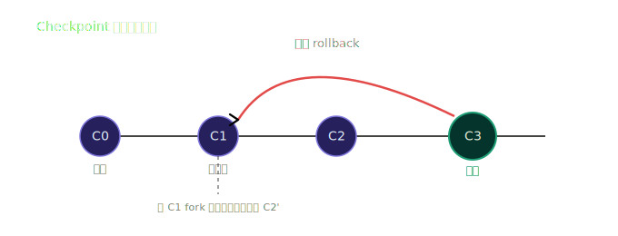
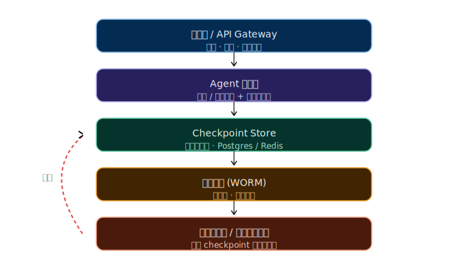

#### 2. 上下文与 checkpoint 怎么回滚

> 核心认知：上下文内容是"派生"的，不是"存储"的。Agent 真正给模型喂的 prompt 由 **系统提示 + 对话历史 + RAG 检索结果 + 工具返回 + 工作记忆** 在每次调用时拼装。因此"上下文回滚"的本质是：**回滚 checkpoint（状态快照），再用旧快照重新派生上下文**。回滚对象永远不是 raw prompt 字符串，而是那个快照。

---

## 一、三种主流回滚架构

### 1. 快照式（Snapshot）— 像数据库 checkpoint

每步把完整状态（对话、变量、工具状态）序列化存一份。回滚 = 加载旧快照。

- 优点：实现最简单，恢复最快。
- 缺点：对话越长，每步存储越贵；难以精确"只退一步"；通常只能覆盖不能分支。

### 2. 事件溯源式（Event Sourcing）— 推荐

只存**不可变事件流**（用户消息、工具调用、工具结果、决策），任何状态都是"重放事件到某点"算出来的。

- 优点：天然可审计、存储省、能回放到**任意时间点**、支持时间旅行调试。
- 缺点：需要重放逻辑，状态重建有计算成本（可用周期快照 + 增量事件缓解）。

### 3. 分支式（Branching / Fork）— LangGraph 同款

Checkpoint 是 DAG 节点而非直线。出错不覆盖，而是从某个点 fork 新分支继续。

- 优点：无损试错，A/B 多轨迹并存，符合"人类决策树"直觉。
- 这正是下图 C3→C1 回滚后还能从 C1 长出新 C2' 的机制。



企业落地首选 **事件溯源 + 分支** 组合：事件流保证合规与精确回放，分支保证试错无损。

---

## 二、根因

1. **上下文是"派生"的，不是"存储"的**：没有独立的"上下文实体"，它由系统提示、对话、RAG、工具结果、记忆在每次推理时动态拼装。因此无法直接"退一段文本"。
2. **真正的状态载体是 checkpoint**：多数框架默认 checkpoint 是"覆盖式"而非"不可变 + 分支"，一旦覆盖就丢了中间态，无法回头。
3. **多步 agent 有副作用**：写库、发消息、调外部 API。只回上下文不回副作用 → 状态不一致，这是回滚最难的部分。
4. **长会话上下文膨胀**：全量快照存储成本爆炸，团队于是干脆不做 checkpoint，等于放弃回滚能力。
5. **缺少审计与审批**：回滚动作本身没有留痕，合规过不了，也没人敢在生产环境放开自动回滚。

---

## 三、距离（当前实现 vs 目标，还差什么）

- **只有对话级"重新生成"，没有 step 级 checkpoint**：出错只能重开会话，丢了整段推理。
- **缺事件溯源**：无法精确回放到某一步，也无法审计"是谁、在哪一步让它走错的"。
- **缺多租户隔离的持久化 store**：回滚能力局限在单会话内存里，跨重启 / 跨租户不可用。
- **缺人工审批门与 WORM 审计**：回滚动作本身不可追溯，生产环境不敢用。
- **长上下文被迫二选一**：要么摘要压缩省钱但丢细节，要么保留原始事件但成本爆炸，没有"摘要 checkpoint + 原始事件"双层方案。
- **副作用无法撤销**：外部调用、数据库写入已经发生了，回滚 agent 状态不等于回滚真实世界。

---

## 四、如果解决

### 4.1 架构选型：事件溯源 + 分支

- 只存不可变事件流，任意状态 = 重放事件到某点。
- checkpoint 用 DAG 节点管理，出错 fork 新分支而非覆盖旧链。
- 事件流本身即审计日志，满足合规。

### 4.2 关键认知：上下文回滚 = 回滚 checkpoint + 重拼上下文

不要试图去改 raw prompt 字符串。先把活跃指针拨回旧 checkpoint，然后让框架用旧状态重新渲染上下文，这才是正确的回滚。

### 4.3 企业三层兜底

1. **多租户隔离 store**：按 `tenant_id + session_id` 分片（独立 schema 或连接），杜绝串号。
2. **WORM 审计日志**：谁、何时、从哪个 checkpoint 退到哪个，全部留痕，不可物理删除。
3. **Human-in-the-loop 审批门**：写操作、外部调用、关键决策的回滚需人工确认，不能自动。

### 4.4 长上下文

用 **摘要 checkpoint + 原始事件保留** 的双层方案：
- 日常推理用摘要 checkpoint，控制成本；
- 精确回滚时重放原始事件，重建细节。
这是事件溯源相对全量快照的核心优势。

### 4.5 副作用处理

- 尽量把副作用封装成"可撤销事务"或"补偿操作"；
- 不能撤销的外部调用（如已发短信），在回滚后必须留痕并人工确认；
- 在审批门前做 checkpoint，让审批前的状态能干净回滚。

---

## 五、企业级回滚分层架构



---

## 六、LangGraph 代码示例

LangGraph 原生用 `(thread_id, checkpoint_id)` 定位状态，回滚就是"指定旧 checkpoint_id 重新执行（fork/replay）"。

```python
from langgraph.checkpoint.postgres import PostgresSaver

# 1. 持久化 checkpoint store（按租户隔离的连接）
with PostgresSaver.from_conn_string(TENANT_A_CONN) as saver:
    saver.setup()

# 2. 编译 graph，绑定 checkpointer
app = graph.compile(checkpointer=saver)

# 3. 正常推进，每步自动写入 checkpoint
app.invoke(
    user_input,
    {"configurable": {"thread_id": "tenant-A/session-1"}}
)

# 4. 回滚：列出历史 checkpoint，找到要回退的那一步
history = list(saver.list(
    {"configurable": {"thread_id": "tenant-A/session-1"}}
))
# history[-1] 是当前，history[k] 是旧状态

# 5. 从 C1 回退并 fork 新分支
app.invoke(
    None,  # 不注入新输入，仅把状态指针拨回 C1
    {"configurable": {
        "thread_id": "tenant-A/session-1",
        "checkpoint_id": C1_ID
    }},
)
# 之后继续 invoke 新输入 → 自动生成新分支 C2'，旧 C2 保留
```

要点：回滚不是删数据，而是把"活跃指针"移到旧 checkpoint，再往下走就是新分支。

---

## 七、触发回滚的典型场景

1. **模型幻觉 / 错误工具调用**：检测置信度低、结果异常、或用户拒绝 → 回退到上一步人工确认。
2. **越权或触红线**：合规策略拦截 → 强制回滚到审批门之前。
3. **用户反悔**："刚才那步走错了" → 回退一步重来。
4. **多方案试算**：同一决策点 fork 多个分支，对比不同工具调用或策略的结果。
5. **灾难恢复**：主 checkpoint store 损坏时，从 WORM 审计日志重放事件流重建状态。
6. **A/B 测试 agent 策略**：同一对话分支出不同策略分支，观测效果。

---

## 一句话总结

**上下文回滚 = 回滚 checkpoint + 重拼上下文；企业项目里用"事件溯源保证可审计、分支保证无损试错、多租户隔离 + WORM 审计 + 人工审批门保证合规"这三层把它兜住。**
