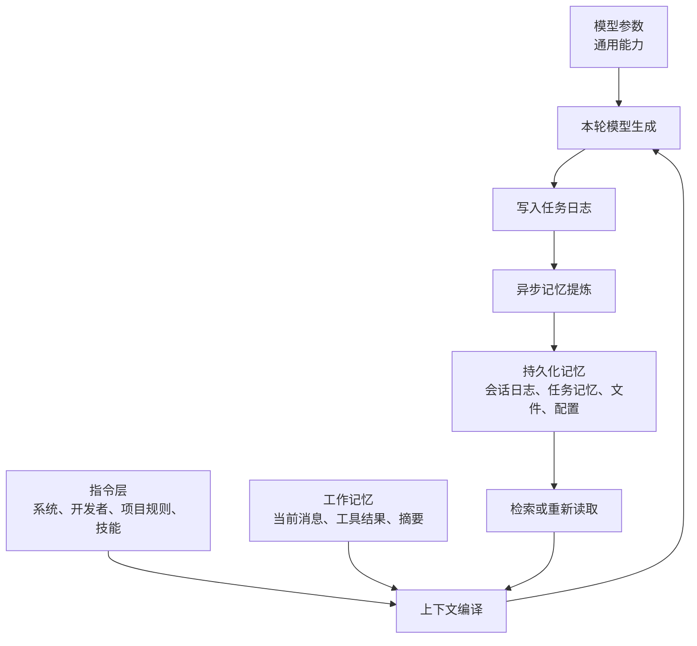

# Codex 记忆系统：设计、生命周期与可验证边界

> 本文描述的是 Codex Agent 在当前桌面环境中如何获得、保留、压缩、检索和遗忘信息。
>
> 证据分为三类：
>
> - **已验证**：通过当前环境的本机文件、SQLite schema 或运行时行为直接确认。
> - **产品级行为**：Codex 可见的运行时行为与公开产品语义。
> - **不可验证**：客户端未提供实现，不能据此推断服务端算法或模型内部状态。
>
> 本文不转录系统提示词、历史会话内容、凭据或任何私人记忆条目。

## 1. 结论

Codex 的“记忆”不是单一数据库，也不是模型参数的即时更新。它由四个层次构成：

1. **模型参数**：提供通用能力，位于模型推理层，不随一轮聊天直接改变。
2. **指令上下文**：系统、开发者、项目和用户给出的约束，按优先级决定本轮行为。
3. **工作记忆**：当前任务中被编译进模型上下文的消息、工具结果、摘要和环境信息。
4. **持久化记忆**：本机的任务日志、线程状态、任务摘要/记忆、配置和工作区文件。



每一轮回答都基于当轮实际提供的上下文生成。所谓“记住”，通常意味着信息仍在当前上下文、可从工作区重新读取，或被持久化记忆系统检索并注入；并不表示模型永久学会了该信息。

## 2. 四层信息状态

### 2.1 模型参数

模型参数保存通用语言、推理和编程能力。它们不是用户可浏览的个人记忆条目，也不能通过本机 Codex 客户端枚举或修改。

本次对话中新增的信息不会立即写回模型参数。因此，用户说过的偏好、项目约定或临时事实不等于模型已经永久学习。

### 2.2 指令上下文

每轮请求都会组合多个指令来源。概念上的优先级如下：

1. 系统级安全与行为约束。
2. 开发者或宿主运行环境的规则，例如工具、文件权限和输出要求。
3. 工作区规则，例如 `AGENTS.md`、项目设置和启用技能的操作说明。
4. 当前用户请求与当前任务先前的对话。

较高优先级的规则会覆盖较低优先级规则；当前明确的用户请求通常会覆盖同一层中较早的偏好。

这层更像“运行时策略”，不是自动学习的长期记忆。

### 2.3 工作记忆

工作记忆是本轮模型真正可访问的信息集合，常见来源包括：

- 当前任务中的用户和助手消息；
- 已执行工具的输出，例如命令结果和读取的文件；
- 当前工作目录、时间、时区、权限和可用工具；
- 按需加载的技能说明和项目规则；
- 长任务被压缩后的目标、关键决策、进度和未完成事项；
- 可能被检索并注入的相关持久记忆。

工作记忆有三个特征：

- **容量有限**：整个会话不一定能逐字永久留在模型上下文中。
- **按轮构建**：不是一个常驻、可随意寻址的进程内内存。
- **可被压缩**：当对话变长时，系统可用摘要保留关键事实，早期逐字过程不保证仍然存在。

### 2.4 持久化记忆

持久化信息可以跨进程、跨任务存在，但是否会在新任务中自动被取回，取决于记忆模式、筛选与检索逻辑。

最可靠的持久化知识通常不是自动摘要，而是用户可审阅的工作区文件：代码、测试、`README.md`、设计文档和架构决策记录。

## 3. 本机可验证的存储设计

以下路径位于当前用户的 Codex 主目录：`/Users/emdoor/.codex`。

| 存储 | 已验证用途 | 关键内容 |
|---|---|---|
| `sessions/YYYY/MM/DD/*.jsonl` | 会话事件源 | 消息、工具调用、工具结果、任务与上下文事件 |
| `state_5.sqlite` | 线程状态与界面索引 | 任务 ID、工作目录、标题、归档、模型、记忆模式 |
| `memories_1.sqlite` | 任务级记忆提炼管线 | 阶段一记忆、摘要、筛选与后台任务状态 |
| `session_index.jsonl` | 会话索引 | 用于定位和管理会话的索引信息 |
| `config.toml` | 客户端配置 | 模型、插件、连接器、项目可信状态等设置 |
| 工作区文件 | 项目知识 | 代码、文档、测试、`AGENTS.md` 等 |

### 3.1 会话事件日志

本机任务记录采用 JSON Lines 格式，每行是一个有 `timestamp`、`type` 和 `payload` 的事件。当前任务可观察到的事件类别包括：

- `session_meta`：会话元信息；
- `turn_context`：某轮的上下文信息；
- `world_state`：宿主环境状态；
- `user_message`：用户消息；
- `agent_message`：助手可见答复；
- `agent_reasoning`：运行时推理记录事件；
- `custom_tool_call` 和 `custom_tool_call_output`：工具调用及结果；
- `token_count`：token 使用统计；
- `task_started`、`task_complete`：任务生命周期事件。

这些日志是记忆提炼的候选源材料，但“存在于日志中”不等于“必然会被未来任务检索”。

### 3.2 线程状态表

`state_5.sqlite` 中的 `threads` 表保存任务元数据，包括：

- `id`、`rollout_path`、`created_at`、`updated_at`；
- `cwd`、Git 信息、标题和预览文本；
- 模型、推理强度、token 使用量；
- 归档、固定、分组等界面状态；
- `memory_mode`，默认值为 `enabled`。

这证明记忆功能至少具有**按任务开关**的状态模型，而不仅是一个全局布尔配置。

### 3.3 阶段一记忆表

`memories_1.sqlite` 中的 `stage1_outputs` 表结构如下：

| 字段 | 含义 |
|---|---|
| `thread_id` | 源任务 ID，主键；每个任务至多一条阶段一输出 |
| `source_updated_at` | 源任务被处理到的时间水位线，用于增量更新 |
| `raw_memory` | 从任务中提取的较完整记忆文本 |
| `rollout_summary` | 任务的紧凑摘要 |
| `rollout_slug` | 与会话记录关联的标识 |
| `generated_at` | 阶段一输出生成时间 |
| `usage_count` | 被使用或检索的累计次数 |
| `last_usage` | 最近使用时间 |
| `selected_for_phase2` | 是否已被选择进入阶段二 |
| `selected_for_phase2_source_updated_at` | 入选阶段二时对应的源任务版本 |

从该 schema 可以可靠推出以下阶段一设计：

```text
完整任务事件
  -> 为每个任务提取 raw_memory 与 rollout_summary
  -> 依据 source_updated_at 增量刷新
  -> 将部分结果标记为 selected_for_phase2
  -> 记录后续使用频次与最近使用时间
```

`raw_memory` 和 `rollout_summary` 并存，表示系统区分了“较完整、便于后续再处理的记忆”与“紧凑、便于浏览或注入上下文的摘要”。

### 3.4 后台作业表

同一数据库中的 `jobs` 表包含：

- `kind`、`job_key`、`status`；
- `worker_id`、`ownership_token`、`lease_until`；
- `started_at`、`finished_at`、`retry_at`、`retry_remaining`；
- `last_error`；
- `input_watermark`、`last_success_watermark`。

这说明提炼设计为可异步执行、可抢占、可恢复、可重试的作业系统，而不是每轮对话必须同步完成的步骤。

## 4. 记忆生命周期

### 4.1 记录

用户消息、模型响应、工具调用和运行时事件写入当前任务的 JSONL 会话日志。线程数据库更新任务标题、路径、更新时间等索引状态。

### 4.2 提炼

后台阶段一作业以任务为单位读取新增事件，并生成 `raw_memory` 与 `rollout_summary`。`source_updated_at` 让系统知道此前已处理到哪里，以支持后续增量提炼。

### 4.3 筛选

阶段一输出不一定全部进入更长期或跨任务的候选集合。`selected_for_phase2` 表明存在第二阶段选择。

可验证的本地 schema 没有包含阶段二最终存储表，因此不能从客户端文件得出阶段二的完整算法或落点。

### 4.4 检索和注入

在记忆模式启用时，系统可以把相关的已提炼信息作为上下文输入的一部分。使用频次和最近使用时间表明系统预留了召回反馈信号。

但是，当前可见实现不足以证明下列任一具体方式：

- 是否使用向量 embedding；
- 是否使用关键词或全文检索；
- 是否由模型二次重排序；
- 每次最多召回多少条；
- 具体注入到提示词的哪个位置；
- 记忆保留、多长时间衰减或删除的策略。

将这些未验证的机制写成既定事实是不准确的。

### 4.5 使用和更新

记忆被使用后，`usage_count` 和 `last_usage` 可记录反馈。源任务有新内容时，可通过 `source_updated_at` 再次生成阶段一输出；阶段二选择记录也带有源版本，避免将过期选择误认为最新结果。

## 5. “记住”与“重新读取”的区别

| 情况 | 是否属于记忆 | 可靠性 |
|---|---|---|
| 仍在当前上下文中的最近对话 | 工作记忆 | 高，但仅限当前任务/上下文容量 |
| 写入 JSONL 的完整历史 | 持久化日志 | 高，但不保证自动注入模型 |
| 写入阶段一摘要 | 自动提炼记忆 | 中等，依赖后续筛选与检索 |
| 写入 `AGENTS.md` 或项目文档 | 显式持久化知识 | 高，可审阅、可重新读取 |
| 已存在但本轮未读取的文件 | 不是当前工作记忆 | 低，除非工具读取或检索它 |
| 模型参数中的一般知识 | 通用能力 | 不应用于保存当前用户事实 |

## 6. 遗忘与不保证项

Codex 不保证永久保留以下信息：

- 未进入持久化存储的临时对话细节；
- 超出上下文窗口且未保留在摘要中的逐字历史；
- 从未被读取的工作区文件；
- 未被调用的连接器或外部服务数据；
- 未被阶段二选中的阶段一候选；
- 被用户、产品设置、保留策略或存储清理移除的数据。

即使一段历史保存在本机日志中，也不意味着每一个未来任务都会把它提供给模型。

## 7. 隐私与权限边界

1. 文件可存储不等于模型会自动读取它。
2. 外部连接器仅在具备授权且被调用时才会提供数据。
3. 当前任务的工具权限约束可访问范围。
4. 不应把自动记忆作为唯一的事实来源或合规存档系统。
5. 不建议直接手工修改 SQLite 数据库来清除记忆；这可能破坏索引、作业状态或会话关联。应优先使用产品提供的删除/归档/记忆控制界面，或先备份后进行受控维护。

## 8. 给项目使用者的建议

对重要、长期、需要被审阅的事实，优先采用显式项目工件：

- 用 `README.md` 描述项目目标和启动方式；
- 用 `docs/` 保存架构、协议与操作手册；
- 用 ADR 记录关键技术决策与理由；
- 用 `AGENTS.md` 记录 Codex 的仓库规范、测试命令和边界；
- 用测试固定行为，而不是依赖自然语言记忆。

自动记忆适合帮助恢复工作脉络、偏好和任务摘要；项目事实应以版本控制中的文件为准。

## 9. 当前审计快照

本文件生成时，对本机数据库仅进行了 schema、事件类型和聚合计数检查，未读取用户记忆正文或历史消息正文。

- `memories_1.sqlite` 的 `stage1_outputs` 当前没有记录；
- `jobs` 当前没有记录；
- 因此，已确认的是客户端的持久化设计，而不是本机已经产生并使用了某一条具体记忆；
- 客户端未提供可验证的阶段二最终存储、检索算法和提示词拼装源码。

## 10. 可验证结论与不可验证结论

### 可验证

- 本机保存了完整任务事件日志和线程元数据。
- 存在按任务的 `memory_mode`。
- 存在以任务为单位的阶段一记忆与摘要存储设计。
- 阶段一支持增量更新、阶段二筛选标记和使用反馈。
- 记忆提炼使用支持重试和租约的异步作业模型。

### 不可验证，不能当作事实

- 阶段二一定使用何种索引或模型；
- 是否使用 embedding、向量数据库、全文检索或重排序；
- 提示词中具体注入格式与位置；
- 服务端是否额外保存、过滤或合并记忆；
- 精确的保留、衰减、删除和跨设备同步策略；
- 模型参数或内部策略的完整实现。

## 11. 一句话模型

Codex 的记忆系统应理解为：**以任务事件日志为事实来源，通过异步摘要提炼形成候选记忆，经过后续选择和检索后，在需要时重新注入有限的当前上下文；工作区文件则是更可靠、可审阅的长期知识载体。**
