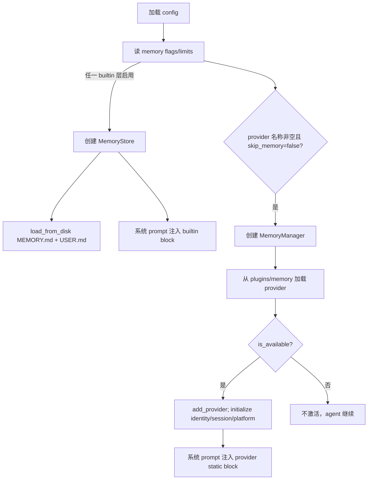

# Hermes 记忆系统设计：双层文件记忆与可插拔长期召回

> 调研日期：2026-08-05
>
> 结论摘要：Hermes 的 memory 是一个完整子系统，而非在 prompt 尾部拼一段文本。它由内建、受字符上限的 `MEMORY.md`/`USER.md`，可选的单个外部 provider，统一生命周期管理器，异步持久化、压缩边界 hook、工具 schema 防线、session identity 传递与配置/备份流程组成。它最值得借鉴的是边界和故障隔离；最不应直接复制的是把复杂 provider 生态无选择地搬入云端多租户 EAF。

## 1. 设计地图

Hermes 有五个相互配合、但职责不同的层：

| 层 | 代码 | 数据/能力 | 是否默认需要外部服务 |
| --- | --- | --- | --- |
| 内建存储 | `tools/memory_tool.py` | `MEMORY.md`、`USER.md`、显式 CRUD、字符预算 | 否 |
| agent 初始化与 prompt | `agent/agent_init.py`、`agent/system_prompt.py` | feature flags、从磁盘加载、系统 prompt 注入 | 否 |
| provider 协议 | `agent/memory_provider.py` | recall、write、tools、压缩/session hooks | 否 |
| provider 编排 | `agent/memory_manager.py` | 单 provider、超时、后台队列、工具路由、安全围栏 | 否 |
| 插件与设置 | `plugins/memory/`、`hermes_cli/memory_setup.py` | provider 发现、配置、密钥、状态、备份 | 取决于插件 |

同时，`~/.hermes/state.db` 的 `SessionDB` 持久化的是 transcript/session 搜索；它是会话正本，不等于长期 memory。对话压缩、大工具结果外置和进程/看板状态也是独立子系统，不能统称 memory。

## 2. 配置、启用条件与初始化

### 2.1 默认配置语义

`hermes_cli/config.py` 的 `memory` section 包含：

```yaml
memory:
  memory_enabled: true
  user_profile_enabled: true
  write_approval: false
  memory_char_limit: 2200
  user_char_limit: 1375
  provider: ""
```

含义：

* `memory_enabled` 控制 agent 私人 notes (`MEMORY.md`) 注入；
* `user_profile_enabled` 控制 user profile (`USER.md`) 注入；
* `write_approval` 可将 add/replace/remove 置于批准门；后台 review 不能阻塞等待用户，因此只会 stage pending entry；
* 两个字符上限是 prompt 预算防线，约分别对应 800/500 tokens；
* 空 `provider` 表示只有 builtin 文件记忆，非“memory 被关闭”。

`memory_enabled: false` 才关闭内建 agent memory。工具是否暴露还受平台 toolset 配置控制，`hermes memory status` 会分别展示注入、profile、memory tool 和 provider 可用性。

### 2.2 初始化流程

`agent/agent_init.py` 的流程可以概括为：



`skip_memory=True` 通常用于非主 agent/特殊后台路径，避免每个子任务都启动外部 provider。但若明确启用了 `memory` toolset，内建 store 仍会创建，否则工具会指向 `None`。这反映了 Hermes 对“工具功能”和“外部同步”分层处理。

provider 初始化收到比单纯 session id 更多的可信运行时信息：`hermes_home`、platform、agent context、profile identity、workspace、parent session id，以及 gateway 的 user/chat/thread identifiers。这允许 provider 做每个用户或聊天的范围划分，但具体 scope 正确性仍取决于各 provider 实现。

## 3. 内建 MemoryStore：有界、可编辑、文件正本

### 3.1 存储模型

`tools/memory_tool.py` 的 `MemoryStore` 管理两类文件：

| 文件 | 语义 | 典型内容 | 注入条件 |
| --- | --- | --- | --- |
| `MEMORY.md` | agent personal notes / 环境与项目观察 | 约定、工作状态、稳定项目事实 | `memory_enabled` |
| `USER.md` | user profile | 偏好、沟通方式、长期用户信息 | `user_profile_enabled` |

初始化 `load_from_disk()` 从 Hermes memory 目录读取，保留 system-prompt snapshot 相关信息；文件行/条目在内存中维护，最终落盘。它不是 embedding store，不做相似度检索；命中方式是受预算的整块 prompt 注入。

### 3.2 读写与约束

MemoryStore 支持 `add(target, content)`、`replace(target, old_text, new_content)`、`remove(target, old_text)`。工具 schema 将此封装为 model 可调用的 memory 工具；target 受限于 memory/user 两种逻辑目标。

核心约束：

* 每个 target 有字符限额，`format_for_system_prompt()` 显示当前用量百分比；
* 写入沿同一 store 更新，避免仅把内容留在 agent 瞬态状态；
* approval gate 可对前台写要求确认，对后台 review 则创建 pending/staged 项而不是隐式写入；
* memory 相关工具写成功后可通知外部 manager，使 provider 镜像显式的、用户可见的事实变更；
* 内建存储的错误不应让 agent 初始化失败，memory 是 optional feature。

这是一种非常可审查的设计：用户可以打开 Markdown 理解/改正内容，且固定字符预算防止小型 memory 演化成无限 system prompt。

### 3.3 prompt 组装位置

`agent/system_prompt.py` 有两层 prompt：稳定部分包含基础规则、context files、能力描述；memory 在 volatile tier 注入，以避免将频繁变动内容错误视为永久缓存前缀。顺序为：

1. 若启用，追加 `MEMORY.md` 的格式化 block；
2. 若启用，追加 `USER.md` block；
3. 若外部 manager 存在，追加其 `system_prompt_block()`；
4. 每轮 recall 则通过单独 memory-context 路径插入，不应成为 UI 可见回复。

两种文件都是“系统可见的参考信息”，但不应被当作高优先级命令。真实安全仍取决于 system prompt 把文件内容当 data，以及 memory 写权限/审批的限制。

## 4. MemoryProvider 协议：外部长期记忆的最小生命周期

`agent/memory_provider.py` 定义 ABC。其关键方法如下：

| 生命周期点 | 方法 | 责任与错误预期 |
| --- | --- | --- |
| 发现前 | `name`、`is_available()` | 检查配置、依赖、凭据；不应做网络请求 |
| 启动 | `initialize(session_id, **identity)` | 连接、建索引/资源、热身 |
| 静态 prompt | `system_prompt_block()` | 仅 provider 说明；不承载每轮检索 |
| 调用前 | `prefetch(query, session_id)` | 返回相关 memory 文本；应快，失败可跳过 |
| 下一轮预热 | `queue_prefetch(query, session_id)` | 后台提前计算 recall |
| 调用后 | `sync_turn(user, assistant, messages)` | 写 completed turn；不得阻塞用户回合 |
| 显式操作 | `get_tool_schemas()`、`handle_tool_call()` | 向模型暴露 save/search/forget 等函数 |
| session 边界 | `on_session_end()`、`on_session_switch()` | 抽取、flush、在 resume/fork/reset/压缩后重绑 state |
| context 边界 | `on_pre_compress(messages)` | 从即将离开 prompt 的内容提炼值得保留线索 |
| 其他观察 | `on_memory_write()`、`on_delegation()`、`backup_paths()` | 镜像 builtin 写、观察子任务、纳入备份 |
| 退出 | `shutdown()` | flush/关连接，不能无限阻塞 |

协议很重要的一点是：memory provider 可以增强 agent，却不应成为 agent 正确执行的依赖。所有 I/O 都允许失败、超时或停用。

## 5. MemoryManager：隔离、顺序和 schema 防线

### 5.1 单外部 provider 规则

`MemoryManager` 可以容纳 builtin（如存在）和**至多一个** non-builtin provider。再次注册外部 provider 时会 warning 并拒绝。

原因不是实现偷懒：多 provider 会使同一个事实被多个系统抽取/删除，工具 schema 变大且重名，召回块相互矛盾，最终模型无法判断哪一个可信。对于没有明确数据合并策略的 agent，这是正确默认。

### 5.2 provider 工具的安全路由

manager 做三道防线：

1. `normalize_tool_schema()` 接受裸 function schema 或已包 OpenAI function schema；无顶层 `name` 的损坏 schema 被跳过。严格模型（含 DeepSeek）会因一条坏 schema 拒绝整个 tools 请求，因此这个检查是 availability 要求。
2. provider 不得覆盖 core tool（例如 `clarify`、`delegate_task`）；冲突名字拒绝进入路由表。
3. `get_all_tool_schemas()` 再次过滤重复/保留名；`handle_tool_call()` 按 `tool_name -> provider` 映射分发，provider 异常转换为工具 error 而不是崩溃 turn。

工具能否最终暴露还要经过 toolset 配置。这样 memory plugin 不能悄悄把任意 schema 加入所有平台。

### 5.3 prefetch/retrieval 流程

`prefetch_all()` 先剥离 skill/bundle 展开内容，仅保留用户真正的 instruction；否则一整篇技能文本会污染 embedding 或 profile。

对 builtin provider 可以直接调用；外部 provider 以 daemon thread 运行，默认硬等待 8 秒。若它仍在跑，本轮 recall 跳过，并且在该 provider 返回前不重复启动另一条 prefetch。单个 provider 的失败不会阻止其他 provider 或主对话。

```mermaid
sequenceDiagram
  participant U as User turn
  participant A as Agent runtime
  participant MM as MemoryManager
  participant P as External provider
  participant L as LLM
  U->>A: message
  A->>MM: on_turn_start + prefetch_all(clean query)
  MM->>P: prefetch in daemon thread
  alt completed before timeout
    P-->>MM: fenced recalled context
    MM-->>A: recall block
  else timeout/error
    MM-->>A: empty recall + log/metric
  end
  A->>L: model request with bounded reference data
  L-->>A: assistant response
  A->>MM: sync_all; queue_prefetch_all
  MM->>P: serialized background write (FIFO)
```

### 5.4 写入顺序、关闭与 session 切换

`sync_all()` 不在用户完成回合路径中直接联网。它使用 lazy、单 worker 的 daemon executor：turn N 的 `sync_turn` 保证先于 turn N+1，慢/坏 provider 不能让 TUI/gateway 永远显示 running。队列任务区分 durable write 和预取；关闭时有限时间 drain，超时任务会被记录为 abandoned 而非阻塞进程。

session rotation 是特别容易写错的边界。`commit_session_boundary_async()` 将旧 session 的 `on_session_end(messages)` 与新 session 的 `on_session_switch(new_session_id, parent_session_id, ...)` 放入同一串行任务，严格执行 end -> switch。否则晚到的旧 session 提炼可能用已经改变的 provider 内部 session id 写到新会话。

`on_session_switch` 同样覆盖 resume、branch、reset、rewind 和压缩续接；provider 被告知是否 reset/rewound。`on_pre_compress` 可返回候选洞见，被 compression prompt 采纳，但它不替代 session transcript 正本。

## 6. Recall 隔离、UI 与 prompt-injection 防线

外部记忆是不可信的数据面。MemoryManager 中有：

* `sanitize_context()`：剥离 `<memory-context>`、内部 system note 和伪造 tag；
* `StreamingContextScrubber`：以状态机处理流式 chunk，避免 opening/closing tag 跨 chunk 时把内部 recall 泄露到 UI；
* context fence：召回内容标注为“不是新的用户输入，而是 informational/authoritative reference data”。

这解决两个不同问题：不让内部数据出现在 assistant 可见文本；不让模型把召回文本里的“忽略规则、运行命令”等内容提升为指令。后者仍需要上层 system policy、工具权限与服务端授权配合，标签不是安全边界本身。

## 7. 插件生态与数据驻留

插件发现从 bundled `plugins/memory/<name>/` 和用户的 `$HERMES_HOME/plugins/<name>/` 扫描；bundled 同名项优先。每个目录带 `plugin.yaml`，声明依赖、环境变量和 hooks；`hermes memory setup` 可发现、配置、显示状态。

本机源码当前的典型 provider：

| provider | plugin 描述的核心语义 | 主要驻留/依赖取舍 |
| --- | --- | --- |
| Hindsight | knowledge graph、entity resolution、多策略 retrieval | client/服务依赖；有 session-end hook |
| Mem0 | 服务端 LLM fact extraction、语义搜索、去重/reranking | 需审查其 server/embedding 数据流 |
| OpenViking | context database、自动提取、tiered retrieval、文件式知识浏览 | HTTP/服务端交互 |
| Holographic | 本地 SQLite fact store、FTS5、trust score、HRR compositional retrieval | 本地优先，仍须评估实验性检索语义 |
| Supermemory | profile recall、semantic search、显式工具、session ingest | 可 hosted 或 self-hosted |
| RetainDB | cloud API、hybrid search、七类 memory | API key 和云端数据驻留 |
| ByteRover | persistent knowledge tree、tiered retrieval | 外部 `brv` CLI；pre-compress hook |
| Honcho | 跨 session user model、dialectic Q&A、语义搜索、结论 | 第三方 SDK/服务 |

它们共享 provider 协议，不共享数据模型、删除行为、retention、embedding 模型、地域、成本或合规承诺。配置某个 provider 不等于“启用 Hermes memory”这一种统一的隐私等级。

## 8. 与 SessionDB、压缩、subagent 的边界

### 8.1 SessionDB 不是 memory provider

`hermes_state.py` 的 `SessionDB` 在 `~/.hermes/state.db` 保存 sessions/messages，并提供 SQLite FTS5、trigram/CJK 检索、WAL/DELETE 回退、写重试和 maintenance。这是可搜索 transcript 与服务状态的数据库；它不自动把搜索结果塞进每轮 agent prompt，也不等价于 profile/fact memory。

### 8.2 压缩不是记忆

`agent/conversation_compression.py` 的摘要/partial-compress 用于让当前模型窗口继续。provider 的 `on_pre_compress` 只是一个机会：在旧消息即将从**模型 context**移除时提炼潜在长期信息。完整会话仍属于 SessionDB/归档；压缩摘要不应直接被当作可长期相信的用户事实。

### 8.3 subagent 不是共享用户记忆

provider 初始化有 `agent_context`（primary、subagent、cron、flush 等）信息，协议文档也要求 provider 对非 primary 写入保持谨慎，防止 cron/system prompt 污染用户表征。`on_delegation` 让父 agent provider 获得 task/result 的受控观察，而不是让每个子 agent用同一用户长期 memory 全权限读写。

## 9. 优势、局限与对 EAF 的建议

### 9.1 Hermes 的优势

* 内建 Markdown memory 与外部语义 memory 分离，且均可独立关闭；
* 严格字符预算、写审批与 pending 流程；
* provider 慢/坏不会直接阻塞主回复；
* 处理 session 切换、压缩、流式 UI、工具 schema 与 skill pollution 的真实工程边缘；
* session transcript、memory、临时大结果、任务状态各自分层。

### 9.2 Hermes 的局限

* provider 的可信度与数据治理高度不一致；单一 Python protocol 不能自动保证隔离；
* 自动 `sync_turn` 仍可能将未确认/低价值聊天写给外部系统，需用户知情与类别过滤；
* 文件 memory 是整块注入，不具备细粒度 provenance/冲突管理；
* “一个外部 provider”控制了复杂度，但 builtin 与 external mirror 仍可能产生双写/最终一致性问题；
* 本地 CLI/gateway 的身份字段无法直接代替 EAF 云端的正式 tenant/ACL 模型。

### 9.3 EAF 的采纳顺序

1. 保持 EAF Phase 1 不挂 memory middleware；先完成 production checkpointer、workspace namespace 与 run audit。
2. 先做类似 Hermes builtin 的**显式、可查看/删除、有限额** profile/fact API，但使用 EAF host 的认证 identity，不让模型选择 tenant/scope。
3. 若未来接 provider，采纳 Hermes 的单 external provider、schema normalization、预取超时、串行异步写、session-boundary 顺序和 streaming scrubber。
4. 不直接复制 provider 插件。先制定 adapter contract、DPA/数据驻留、删除传播、metrics 与 kill switch，再逐个评估 provider。
5. 任何 recall 以来源明确的 reference block 注入，永远不赋予工具权限、不显示给浏览器、不覆盖系统规则。

## 10. 源码索引

| 主题 | 源码 |
| --- | --- |
| MemoryProvider protocol | `/Users/emdoor/Documents/projects/integrate/hermes-agent/agent/memory_provider.py` |
| manager、超时、队列、hooks、工具路由 | `/Users/emdoor/Documents/projects/integrate/hermes-agent/agent/memory_manager.py` |
| 内建 Markdown store / memory 工具 / approval | `/Users/emdoor/Documents/projects/integrate/hermes-agent/tools/memory_tool.py`、`tools/write_approval.py` |
| feature 初始化、身份传递 | `/Users/emdoor/Documents/projects/integrate/hermes-agent/agent/agent_init.py` |
| system prompt volatile memory blocks | `/Users/emdoor/Documents/projects/integrate/hermes-agent/agent/system_prompt.py` |
| 调用前 recall、回合同步 | `/Users/emdoor/Documents/projects/integrate/hermes-agent/agent/turn_context.py`、`agent/turn_finalizer.py` |
| compression hooks | `/Users/emdoor/Documents/projects/integrate/hermes-agent/agent/conversation_compression.py` |
| provider 发现与设置 | `/Users/emdoor/Documents/projects/integrate/hermes-agent/plugins/memory/__init__.py`、`hermes_cli/memory_setup.py` |
| session transcript/FTS 数据库 | `/Users/emdoor/Documents/projects/integrate/hermes-agent/hermes_state.py` |
