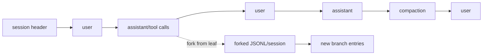

# Pi 记忆系统设计：会话正本、项目上下文与扩展边界

> 调研日期：2026-08-05
>
> 结论摘要：Pi 没有 Hermes 式“自动跨会话语义记忆 provider”。它把长期可恢复性建立在**本地 append-only session JSONL、可分支会话树、项目/全局上下文文件、资源加载器和扩展状态**上。这不是缺少一块实现，而是 coding CLI 的刻意架构：完整原始历史可回放，模型上下文是从当前会话分支投影出来的有限视图；跨会话偏好或知识由用户文件和扩展按需实现。

## 1. 本文范围

“记忆”在 Pi 中并非一个单独模块，因此必须拆开讨论：

| 层次 | Pi 的实现 | 跨 session | 是否自动进入每轮 prompt | 是否是语义检索 |
| --- | --- | --- | --- | --- |
| 活动会话上下文 | `AgentSession.agent.state.messages` | 当前 session / resume | 是 | 否 |
| 会话正本 | `SessionManager` 的 JSONL 事件日志 | 是 | 否，先重建投影 | 否 |
| 压缩摘要 | `compaction` / `branch_summary` entry | 当前分支 | 是 | 否 |
| 项目指令 | `AGENTS.md`、`CLAUDE.md` 等 context files | 是 | 是，加载时 | 否 |
| 技能、prompt、扩展 | `DefaultResourceLoader` | 是 | 取决于资源类型与调用 | 否 |
| 扩展自定义状态 | custom entry/custom message 等 | 可由扩展决定 | 可由扩展决定 | 扩展可自行实现 |

因此下文中的“Pi memory system”是这套组合，而不是虚构一个不存在的向量数据库或用户画像服务。

## 2. 设计目标与总体取舍

Pi 是本地 coding agent，根本单位是以当前工作目录为中心的 session。它优先解决：

1. 用户能够恢复、导出、检查和分支一个编码会话；
2. 模型在长任务中可通过压缩继续工作；
3. 项目规则与用户本地配置可被明确加载；
4. 扩展可以加入自己的行为而不让核心强制选择某个 memory 服务。

它没有把下面行为设为默认：

* 从所有聊天自动提取“永久事实”；
* 将用户/项目内容嵌入到共享向量库；
* 在新项目自动召回旧项目的语义片段；
* 将任意历史文本提升为 system instruction。

这降低了隐私、成本、陈旧事实、跨项目串扰和不可解释性。代价是“用户偏好自动跨会话延续”不是核心功能，需要通过 context file 或 extension 明确搭建。

## 3. 持久化会话：JSONL 是正本，不是 prompt 缓存

### 3.1 文件位置与创建

实现：`/Users/emdoor/Documents/projects/integrate/pi/packages/coding-agent/src/core/session-manager.ts`。

默认目录由 `getDefaultSessionDir()` 根据规范化 `cwd` 编码：

```text
~/.pi/agent/sessions/--<encoded-absolute-cwd>--/<timestamp>_<session-id>.jsonl
```

这使不同仓库/工作目录的 session 物理分组。`SessionManager` 也支持：

* `SessionManager.create(...)`：创建持久 session；
* `SessionManager.open(path, ...)`：读取一个已有 JSONL 后 resume；
* `SessionManager.inMemory(...)`：不落盘的临时 session；
* 导入、导出、clone、fork、resume 等 CLI 流程。

持久化采用 JSON Lines：每行一个 JSON entry。首行是 `session` header，记录 session id、cwd、时间等；后续每条 entry 带 UUID、时间戳及 parent 关联。`_persist()` 以同步追加写实现：首个 assistant 消息到来前延迟创建，随后 `appendFileSync()` 追加。该选择易于人工检查、备份与导出，适合本机单用户 CLI；并不承诺多进程并发写或网络共享文件系统的事务安全。

### 3.2 entry 类型与信息保真

session 文件保存的不是简单 `[user, assistant]` 数组。关键类型包括：

| entry | 内容 | 是否成为模型消息 |
| --- | --- | --- |
| `session` | header、cwd、元数据 | 否 |
| `message` | user、assistant、toolResult 等原始 agent message | 是 |
| `compaction` | 结构化摘要、`firstKeptEntryId`、usage、details | 是，转换为 summary message |
| `branch_summary` | 分支摘要 | 是，转换为 branch summary message |
| `model_change` / `thinking_level_change` | 会话运行设置变更 | 不直接作为消息，但参与恢复设置 |
| `label` 等展示元数据 | UI/管理状态 | 否 |
| `custom` / `custom_message` | extension 定义的状态或模型可见内容 | 取决于种类 |

`sessionEntryToContextMessages()` 做投影而不是裸转储：无 content 的历史消息被防御性规整为空数组，普通 custom entry 不进入模型上下文，而 `custom_message` 和摘要类 entry 才能被转换。这保护了模型输入不被 UI 标签或任意扩展记录污染。

### 3.3 分支模型

每个 entry 通过 `parentId` 指向前一个节点，当前 session 选择一个 `leafId`。`buildSessionPath()` 由 leaf 向根回溯，得到当前分支；同一原始 session 可以从历史节点 fork，而不覆盖旧路径。



这是 Pi 最重要的“工作记忆”机制：原始过程仍可查看，当前模型只沿选定分支恢复，不会自动把兄弟分支的结论带进来。

## 4. 上下文重建与 compaction：完整历史不等于模型输入

### 4.1 投影算法

实现核心是 `buildContextEntries()` 和 `buildSessionContext()`：

1. 找到由 `leafId` 代表的当前分支路径；
2. 扫描该路径的最新 `compaction` entry；
3. 若没有压缩，当前 branch path 直接形成 context；
4. 若有压缩，context 由“最新 compaction 摘要 + 从 `firstKeptEntryId` 起保留的旧 tail + compaction 之后新消息”组成；
5. 调用 `sessionEntryToContextMessages()` 生成 agent state messages，并同时恢复最近的 model/thinking 设置。

旧条目没有被删除，只是不进入本次 prompt。这一分离是 Pi 处理长会话的基础：JSONL 是审计/回放正本，context 是可变、有预算的投影。

### 4.2 何时压缩

实现：`core/compaction/compaction.ts` 与 `core/agent-session.ts`。

默认配置：

```ts
{ enabled: true, reserveTokens: 16384, keepRecentTokens: 20000 }
```

触发条件为估算的 context token 超过 `contextWindow - reserveTokens`。估算优先使用最近成功 assistant response 的 provider usage（`totalTokens`，或 input/output/cache 组成），把最近 usage 后新增消息再用估算补齐；没有可信 usage 时才按文本、工具参数、thinking、图片等保守估算。这避免只按字符长度导致阈值过早或过晚。

AgentSession 区分三类入口：

* 用户显式 `/compact`：生成摘要；
* 正常阈值触发：在本轮结束后自动压缩，用户继续后再发下一条；
* provider `context overflow`：清理错误状态、压缩一次、自动 retry。连续 overflow 不无限重试。

### 4.3 切分完整性

压缩不是按数组下标随意截断。`findCutPoint()` 从新到旧累积 tail token，选择合法切点，并遵守：

* 不在 `toolResult` 上切断，避免 tool call/result 配对损坏；
* 优先在 user-like/assistant 边界切；
* 当切在一轮中间时识别 `turnStartIndex`；
* 带上紧邻但不影响 context 的 metadata；
* 图片按固定保守字符数估算，复杂内容不会被当成空文本。

摘要前通过 `serializeConversation()` 将消息序列化为“用户、assistant thinking、tool call、tool result”的文本记录；工具结果每段有最大字符限制，避免摘要调用自身超出预算。摘要 prompt 要求输出固定工作状态：Goal、Constraints、Done/In Progress/Blocked、Key Decisions、Next Steps、Critical Context，并保留精确路径、函数名和错误。

### 4.4 文件操作作为可续接线索

Pi 在 compaction 时扫描 assistant tool call：`read`、`write`、`edit` 的 `path` 被提取并归类。摘要 details 保存只读文件与修改文件列表，摘要文本也加入 `<read-files>` / `<modified-files>`。它不是语义记忆检索，但在 coding 任务继续时极有效：后续模型能知道哪些文件已经看过/改变过，而不靠摘要模型自由发挥。

## 5. 项目上下文文件：instruction resources，不是自动记忆

### 5.1 发现顺序

实现：`core/resource-loader.ts` 的 `loadProjectContextFiles()`。

Pi 会寻找以下名称：`AGENTS.md`、`AGENTS.MD`、`CLAUDE.md`、`CLAUDE.MD`。加载顺序是：

1. agent 目录中的全局 context file；
2. 从 filesystem root 到当前 cwd 的祖先目录 context files；
3. 当前 cwd 的 context file。

祖先列表用 `unshift()` 保证由外到内排列，因此越接近项目的文件自然更靠后、更具体。实际 source path 被保留，重复路径去重。

这些文件在 session/service 创建时通过 `DefaultResourceLoader` 加载，进入 system prompt 的方式由 `buildSystemPrompt` 和资源设置控制。它们应理解为版本化的项目指令/约束，不是通过聊天自动生成的“关于用户的事实”。

### 5.2 资源系统与 trust

`DefaultResourceLoader` 统一装载：context files、skills、prompt templates、themes、extensions 和 package resources；它有 reload、source metadata、冲突诊断、dedupe 与 project trust bootstrap。

项目 local extension 可能执行代码，故 reload 前先用非信任项目设置加载，获得用户的 trust 决策后才让项目扩展参与。这与 memory 的安全关系很直接：项目文件内容虽然可被送入 prompt，但项目扩展的代码执行必须以信任边界隔离。EAF 将来若模仿 Pi 的 context file 发现，应同样区分“可读 prompt 文本”和“可执行扩展代码”。

## 6. 扩展怎样实现自己的 memory

Pi 的核心不是 memory-provider 框架，但 extension APIs 提供足够的挂点：

* session entries 可保存 `custom` / `custom_message`；
* 压缩前/后有 extension handler，例如 `session_before_compact`、`session_compact`；
* session switch/fork/shutdown 事件可用；
* extension 可以管理自身存储、额外工具、system prompt 和资源。

一个 Pi memory extension 可以自行：将偏好存本地 SQLite/JSON、在新 turn 读取、把有限 recall 作为 custom message 或 prompt block、在 compaction 时把结构化索引写进 `details`。但这些策略没有被 Pi core 规定，这意味着扩展作者负责：scope、隐私、迁移、冲突、删除、检索 token 预算和 UI 展示。

这个自由度的优点是核心无 vendor lock-in；缺点是不同 extension 无法天然共享一致的身份、授权和数据删除协议。因此不应将 Pi extension 的 session custom entry 误当作全局 memory 标准。

## 7. 安全、隐私与可靠性分析

### 7.1 其安全模型的前提

Pi 的默认模型是本地用户控制自己的 `~/.pi` 与仓库目录。其 JSONL 会话可能包含 prompt、源码片段、工具输出、模型回复和凭据误输入，因此 OS 文件权限、磁盘加密和 session export/share 行为是主要边界。

对远程多租户服务，不能照搬：

* `encoded-cwd` 不等于授权 namespace；
* `appendFileSync()` 不替代并发控制、事务、加密或 tenant ACL；
* JSONL 共享盘没有可靠的多 writer 语义；
* 从祖先目录自动读 AGENTS/CLAUDE 需要信任与路径限制；
* session 导出/分享必须成为显式授权行为。

### 7.2 已有可靠性设计

* session header 扫描有字节上限，避免读取异常大头部；
* 解析旧版本或手改 JSONL 时对缺失 content 做兼容；
* compaction 只影响 context 投影，不覆盖原始 entry；
* overflow 恢复只重试一次，防止循环；
* branch 依赖 parent relation，避免将所有 fork copy 成独立不可追溯 transcript；
* project trust 先于项目扩展加载。

### 7.3 仍由宿主/扩展承担的责任

Pi 未提供语义 memory 的来源审计、敏感信息分类、保留期、按用户删除、跨设备同步、embedding provider 合规或跨项目 ACL。这是合理的范围控制；把它移植成服务时必须补齐，而不是把 JSONL 改名为数据库。

## 8. 对 EAF 的直接启示

1. **借鉴正本与投影分离**：EAF 的 LangGraph checkpoint/工件 history 不能和模型 context 混为一谈；summary 应是可替换投影，不应删除正本。
2. **借鉴分支语义，不复制 SessionManager**：若 EAF 要做 UI branch/resume，应在 host metadata 层记录 parent/leaf lineage，而非在 middleware 内再建 JSONL 正本。
3. **将项目指令与用户长期记忆分开**：Pi 的 AGENTS/CLAUDE 模式适合项目规则；它不应成为自动写入的用户画像文件。
4. **可选记录 coding 线索**：已读/已改文件可作为摘要 metadata 或 run audit，前提是路径在 tenant workspace 内；不能当作跨用户记忆。
5. **云端不要照搬同步 JSONL 写**：EAF 应继续使用持久 LangGraph checkpointer 和 host DB/object storage；JSONL 可作为导出格式而非服务内部唯一数据库。

## 9. 源码索引

| 主题 | 源码 |
| --- | --- |
| session 正本、DAG、context 投影 | `/Users/emdoor/Documents/projects/integrate/pi/packages/coding-agent/src/core/session-manager.ts` |
| turn 持久化、手动/自动/overflow compaction | `/Users/emdoor/Documents/projects/integrate/pi/packages/coding-agent/src/core/agent-session.ts` |
| 切点、token、结构化摘要 | `/Users/emdoor/Documents/projects/integrate/pi/packages/coding-agent/src/core/compaction/compaction.ts`、`utils.ts` |
| 分支摘要 | `/Users/emdoor/Documents/projects/integrate/pi/packages/coding-agent/src/core/compaction/branch-summarization.ts` |
| session 生命周期与 resume/fork | `/Users/emdoor/Documents/projects/integrate/pi/packages/coding-agent/src/core/agent-session-runtime.ts` |
| context files、资源与 project trust | `/Users/emdoor/Documents/projects/integrate/pi/packages/coding-agent/src/core/resource-loader.ts`、`agent-session-services.ts` |
